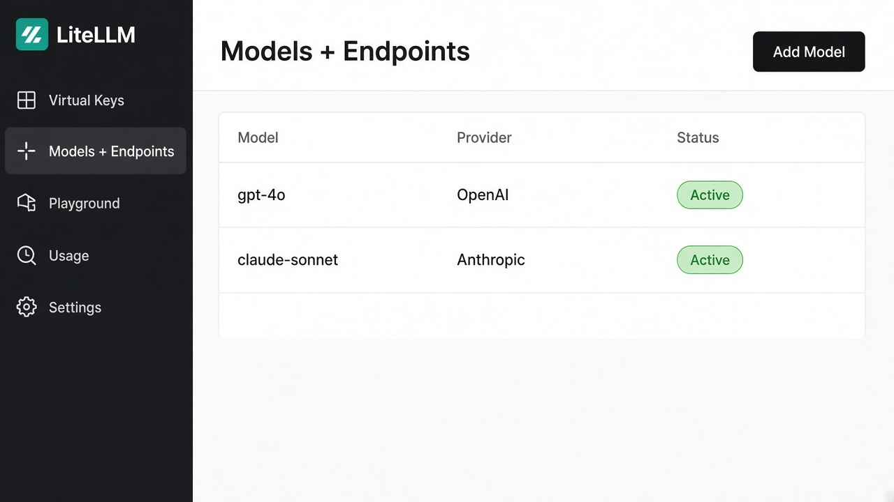
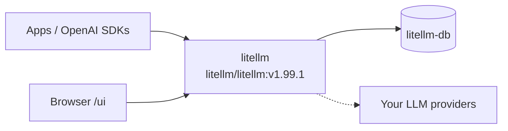

<div align="center">

# LiteLLM on Render

Deploy **LiteLLM**, the OpenAI-compatible LLM gateway, on Render with the official Docker image and managed PostgreSQL. Add models in the Admin UI; call the proxy from any OpenAI SDK.

<p>
  <a href="https://render.com/deploy-template/api/github/start?template_repo=litellm-render-template">
    
  </a>
</p>

<p>
  <a href="https://render.com">
    
  </a>
  <a href="https://github.com/BerriAI/litellm">
    
  </a>
  <a href="https://hub.docker.com/r/litellm/litellm">
    
  </a>
  <a href="https://docs.litellm.ai">
    
  </a>
</p>

</div>



## What This Template Shows

This repo wraps BerriAI's official monolithic image as a one-click Render Blueprint. It matches the upstream [docker-compose quickstart](https://docs.litellm.ai/docs/proxy/docker_quick_start): one proxy process plus Postgres. Redis is not included, because LiteLLM only requires it when you run more than one instance.

| Piece | Role |
| --- | --- |
| **[LiteLLM](https://github.com/BerriAI/litellm)** | OpenAI-compatible gateway, virtual keys, spend logs, Admin UI |
| **[litellm/litellm:v1.99.1](https://hub.docker.com/r/litellm/litellm)** | Official image with Prisma migrations bundled |
| **[Render Web Service](https://render.com/docs/web-services)** | Pulls the image on a Pro instance (4 GB) |
| **[Render PostgreSQL](https://render.com/docs/postgresql)** | Keys, teams, models, and spend logs |

Provider keys (OpenAI, Anthropic, and the rest) are added in the UI after login. Render does not offer an LLM gateway primitive; this template runs LiteLLM's own proxy.

## Architecture



### How It Works

1. Click **Deploy to Render**. Render forks this template into your GitHub account and applies [`render.yaml`](./render.yaml).
2. On Apply, paste `LITELLM_MASTER_KEY` and `LITELLM_SALT_KEY`. Both must start with `sk-`. `OPENAI_API_KEY` can be left blank.
3. Render pulls `docker.io/litellm/litellm:v1.99.1`, wires `DATABASE_URL`, and starts one Uvicorn worker on port `4000`.
4. Open `https://<service>.onrender.com/ui`. Username is `admin`. Password is the master key.
5. Add a model, create a virtual key, then call `/v1/chat/completions`.

| Resource | Type | Plan | Notes |
| --- | --- | --- | --- |
| `litellm` | Web (`runtime: image`) | **pro** | Health check `/health/liveliness`. Auto-deploy off. |
| `litellm-db` | PostgreSQL 16 | **basic-256mb** | Internal URL only (`ipAllowList: []`). |

Default region: **oregon**. The proxy is stateless; all durable state lives in Postgres. Horizontal scale needs a Render Key Value instance for Redis, which this Blueprint does not create.

## Quick Start

### Prerequisites

- A [Render account](https://dashboard.render.com/register?utm_source=github&utm_medium=referral&utm_campaign=ojus_demos&utm_content=readme_link)
- Two secrets that start with `sk-` (master key and salt key)
- An LLM provider key when you are ready to add a model (not required at Apply)

Generate the two LiteLLM secrets:

```bash
echo "sk-$(openssl rand -hex 24)"
echo "sk-$(openssl rand -hex 24)"
```

Keep the salt key. Changing it after you add models makes stored provider credentials unreadable.

### Deploy

1. Click **Deploy to Render** above and fork into your GitHub account.

   <p>
     <a href="https://render.com/deploy-template/api/github/start?template_repo=litellm-render-template">
       
     </a>
   </p>
2. On Apply, set `LITELLM_MASTER_KEY` and `LITELLM_SALT_KEY`. Leave `OPENAI_API_KEY` empty unless you want it available as `os.environ/OPENAI_API_KEY` in the UI.
3. Wait until the web service is **Live** (~4–10 minutes; first image pull and Prisma migrate can take longer).
4. Open `/ui`, sign in as `admin` with the master key, and add a model.
5. Create a virtual key and send a test completion.

```bash
curl --fail --silent "https://<your-service>.onrender.com/health/liveliness"

curl "https://<your-service>.onrender.com/v1/chat/completions" \
  -H "Authorization: Bearer <virtual-key>" \
  -H "Content-Type: application/json" \
  -d '{"model":"<your-model>","messages":[{"role":"user","content":"Say hello in five words."}]}'
```

## Features

| Feature | Description |
| --- | --- |
| **Official image** | Pinned `litellm/litellm:v1.99.1` (also published at `ghcr.io/berriai/litellm`) |
| **Admin UI** | Models, virtual keys, spend, and playground at `/ui` |
| **OpenAI-compatible API** | Point any OpenAI SDK at the service URL |
| **Postgres-backed keys** | Virtual keys, budgets, and spend logs survive deploys |
| **UI model catalog** | `STORE_MODEL_IN_DB=True` so you do not need a config file |
| **Single worker** | `NUM_WORKERS=1` matches LiteLLM's Kubernetes guidance |

## Configuration

| Variable | Source | Description |
| --- | --- | --- |
| `PORT` | Blueprint | `4000` (image listen port) |
| `HOST` | Blueprint | `0.0.0.0` |
| `NUM_WORKERS` | Blueprint | `1` |
| `LITELLM_MODE` | Blueprint | `PRODUCTION` (disables `load_dotenv`) |
| `LITELLM_LOG` | Blueprint | `ERROR` |
| `STORE_MODEL_IN_DB` | Blueprint | `True`: manage models from the UI |
| `DATABASE_URL` | Wired | Internal connection string from `litellm-db` |
| `LITELLM_MASTER_KEY` | Required (`sync: false`) | Admin API key and UI password. Must start with `sk-` |
| `LITELLM_SALT_KEY` | Required (`sync: false`) | Encrypts provider keys in Postgres. Set once |
| `OPENAI_API_KEY` | Optional (`sync: false`) | Leave blank to add keys in the UI instead |

Other provider keys (`ANTHROPIC_API_KEY`, Azure, Bedrock, and so on) can be added later in the Dashboard or as `os.environ/...` references in the model form. Full list: [LiteLLM docs](https://docs.litellm.ai/docs/proxy/config_settings).

### Pin or bump the image

```yaml
# render.yaml
image:
  url: docker.io/litellm/litellm:v1.99.1
```

`autoDeployTrigger: off` so tag edits do not redeploy until you choose **Manual Deploy**.

## Cost

Approximate monthly compute from [Render pricing](https://render.com/pricing) (Hobby workspace, Oregon):

| Resource | Approx. monthly |
| --- | ---: |
| Web service (Pro, 4 GB) | $85 |
| PostgreSQL (Basic 256 MB) | $6 |
| **Total** | **~$91** |

LLM tokens are billed by your providers. **Pro is the floor.** LiteLLM documents 1 vCPU and 4 GiB per worker because Prisma's query engine holds a high-water memory mark. Downgrading to Standard (2 GB) typically OOMs and Render reports "No open ports detected."

Spend logs can grow. If Postgres disk fills, raise the database plan. Adding Redis later (for multiple instances) is about $10/month on Key Value Starter.

## Troubleshooting

| Problem | Solution |
| --- | --- |
| Health check fails / no open ports | Keep **Pro**. Confirm `PORT=4000` and `HOST=0.0.0.0`. First boot runs Prisma migrate; wait and retry. |
| `Reached heap limit` / OOMKill | Undersized instance. Do not use Starter or Standard. |
| Image pull failures | Confirm `docker.io/litellm/litellm:v1.99.1` exists, then retry the deploy. |
| UI login fails | Username is `admin`. Password is `LITELLM_MASTER_KEY` and must start with `sk-`. |
| Prisma / `self-signed certificate` | Internal `DATABASE_URL` should not require TLS. If you pasted an external URL, switch back to the Blueprint `fromDatabase` value. |
| Models unreadable after a restart | You rotated `LITELLM_SALT_KEY`. Restore the original salt; there is no in-place rotation. |

## Project Structure

```
render.yaml       Render Blueprint (image + Postgres)
README.md         This file
LICENSE           MIT (template wrapper)
.env.example      Optional env overrides
assets/           Hero / logo
```

## Learn More

**Render:**
- [Web Services](https://render.com/docs/web-services)
- [PostgreSQL](https://render.com/docs/postgresql)
- [Blueprints](https://render.com/docs/infrastructure-as-code)
- [Docker images](https://render.com/docs/docker)

**LiteLLM:**
- [Proxy quickstart](https://docs.litellm.ai/docs/proxy/docker_quick_start)
- [Production deployment](https://docs.litellm.ai/docs/proxy/deploy)
- [Production checklist](https://docs.litellm.ai/docs/proxy/prod)
- [GitHub](https://github.com/BerriAI/litellm)

## License

[MIT](LICENSE) for this template wrapper.

Upstream [LiteLLM](https://github.com/BerriAI/litellm) is MIT for the open-source tree. The `enterprise/` directory in that repo has a separate license and is not part of this image wrapper.
